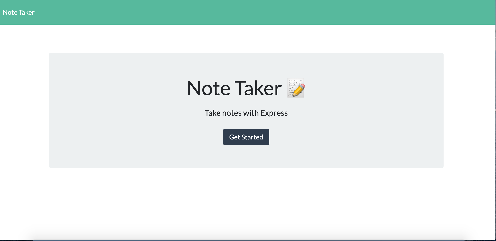
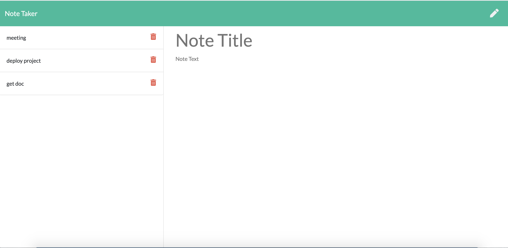

# Note-Taker

 ## Description
  [Bbeyenene](https://github.com/Bbeyenene) developed this app as a sample on personal skill. 
   ## Table of Contents
   * [Installation Instructions](#installation-instructions)
   
   * [Usage Instructions](#usage-instructions)
   
   * [Contribution](#Contribution)
   
   * [Developers Contact Information](#Developers-Contact-Information)
     
* [License](#license)

   ## Installation Instructions
   The developer is authorizing a free installation by cloning from the code [Bbeyenene/Note-Taker](https://github.com/Bbeyenene/Note-Taker).
   ## Usage Instructions
   1. Copy the code from the code [Bbeyenene/Note-taker](https://github.com/Bbeyenene/Note-Taker) and clone it in 
   
   ## Image of the generated webpage
   

   

   ## Contributiion
   [Bbeyenene](https://github.com/Bbeyenene) is the only contrubuter to this project.
   
   ## Developers Contact Information
    * LinkdIn Profile: [Berhane](https://www.linkedin.com/in/berhane-beyene/)
    * URL : [https://infonotebook.herokuapp.com/](https://infonotebook.herokuapp.com/)
    * Email: monoxica2004@yahoo.com
   ## License
    ### This application is licensed under .
  